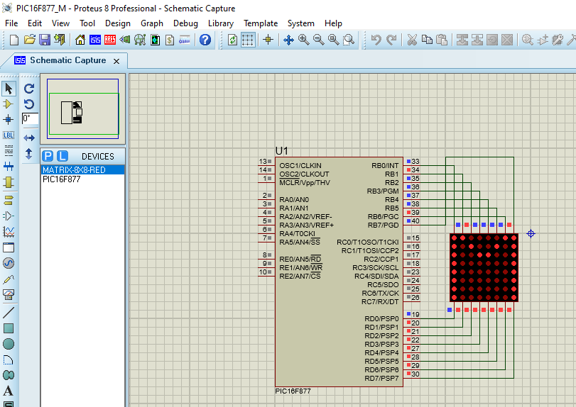

# M-in-Metrix-Display
You can show English Character Display M in 8x8-Metrix Display using PIC16F877 from Proteus Profession 8.0+ and write the program in MikroC 7.6.0 or more 

Download Resources-M.zip
1. Proteus/PIC16F877_M.pdsprj is Working on Proteus [Circuit Design]
2. MikroC/FullMmetrix.c is Program's Code [Program]
3. MikroC/FullMmetrix.mcppi is Opening by mikroC [Program Open with mikroC]
        [2 and 3 should be Build for make this suitable (.hex) file]
4. MikroC/FullMmetrix.hex include in Proteus PIC16F877 Program FIles [Include in PIC16F877]

Run this.

Thanks, 
Rana Bepari

